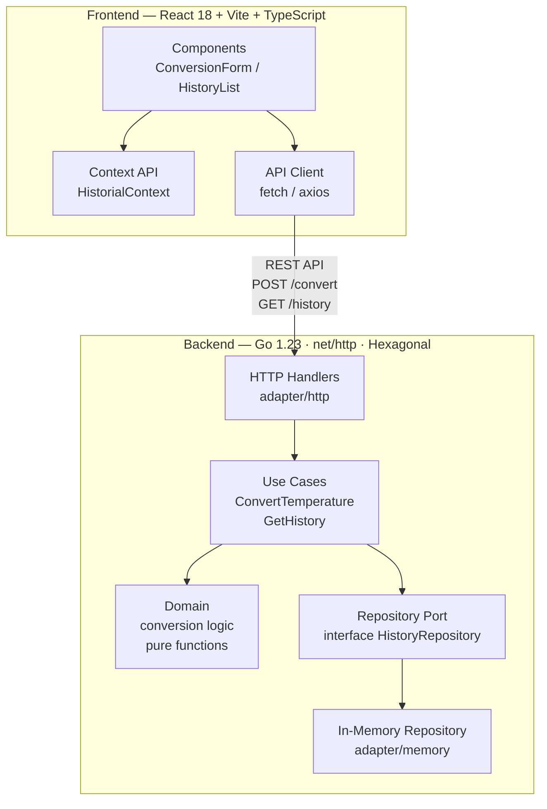

# Diagrama: Architecture Overview

```mermaid
graph TD
  subgraph Frontend["Frontend — React 18 + Vite + TypeScript"]
    UI[Components\nConversionForm / HistoryList]
    CTX[Context API\nHistorialContext]
    CLIENT[API Client\nfetch / axios]
    UI --> CTX
    UI --> CLIENT
  end

  subgraph Backend["Backend — Go 1.23 · net/http · Hexagonal"]
    HANDLER[HTTP Handlers\nadapter/http]
    UC[Use Cases\nConvertTemperature\nGetHistory]
    DOMAIN[Domain\nconversion logic\npure functions]
    PORT[Repository Port\ninterface HistoryRepository]
    REPO[In-Memory Repository\nadapter/memory]

    HANDLER --> UC
    UC --> DOMAIN
    UC --> PORT
    PORT --> REPO
  end

  CLIENT -- "REST API\nPOST /convert\nGET /history" --> HANDLER
```
