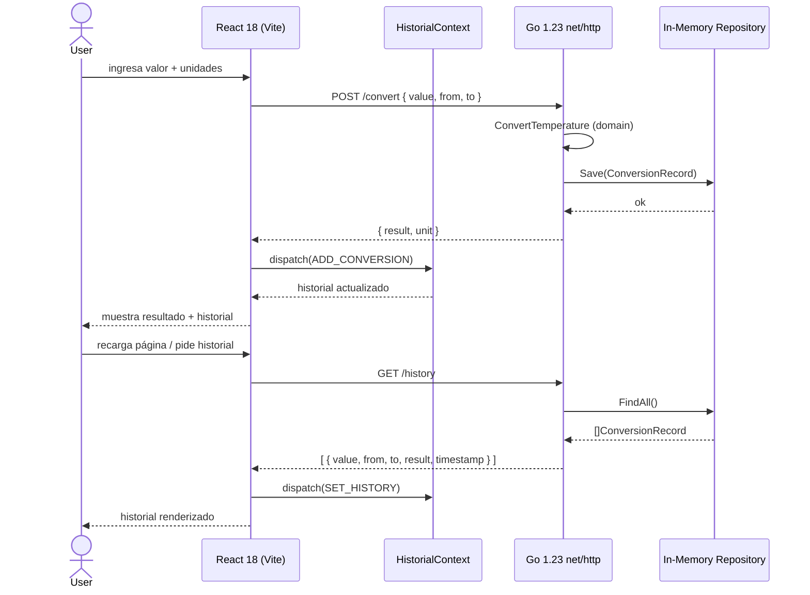

# Diagrama: Data Flow

```mermaid
sequenceDiagram
  actor User
  participant FE as React 18 (Vite)
  participant CTX as HistorialContext
  participant BE as Go 1.23 net/http
  participant MEM as In-Memory Repository

  User->>FE: ingresa valor + unidades
  FE->>BE: POST /convert { value, from, to }
  BE->>BE: ConvertTemperature (domain)
  BE->>MEM: Save(ConversionRecord)
  MEM-->>BE: ok
  BE-->>FE: { result, unit }
  FE->>CTX: dispatch(ADD_CONVERSION)
  CTX-->>FE: historial actualizado
  FE-->>User: muestra resultado + historial

  User->>FE: recarga página / pide historial
  FE->>BE: GET /history
  BE->>MEM: FindAll()
  MEM-->>BE: []ConversionRecord
  BE-->>FE: [ { value, from, to, result, timestamp } ]
  FE->>CTX: dispatch(SET_HISTORY)
  FE-->>User: historial renderizado
```
